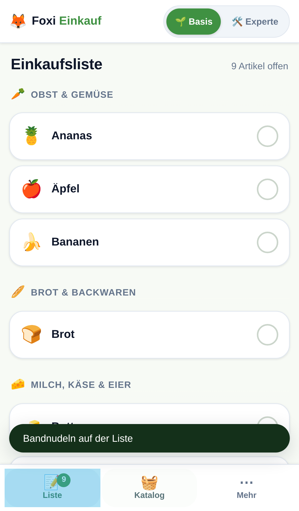
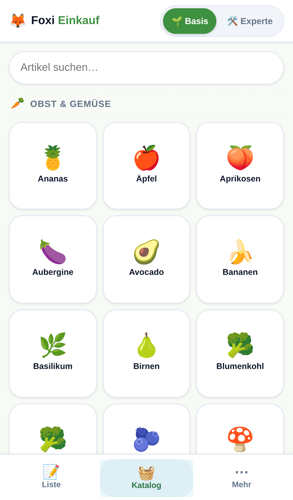

# Foxi – Einkaufsliste für Haushalt, Familie und WG


**Tippen statt Tippen.**

Foxi ist eine Einkaufsliste als Progressive Web App. Artikel kommen durch
Antippen einer Kachel auf die Liste, nicht durch Schreiben. Im Laden tippt man
sie erneut an, um sie abzuhaken. Der Katalog merkt sich dabei, was dieser
Haushalt tatsächlich braucht, und sortiert sich danach – ohne Menüpunkt, ohne
Einstellung, ohne Erklärung.

Foxi gehört zur selben Werkstatt wie [TourFuchs](https://github.com/gunterstruck/tourfuchs)
und [SoundFuchs](https://github.com/gunterstruck/SoundFuchs) und benutzt
deren Gestaltung: dieselben Radien, Schatten, Abstände und denselben
Basis/Experte-Schalter. Nur der Leitton ist grün statt petrol.

---

## Der Grundsatz, dem alles untergeordnet ist

**Alle Daten bleiben auf dem Gerät.** Keine Cloud, kein Konto, kein Login, kein
Backend, kein Analytics, keine externen Anfragen im Normalbetrieb. Wenn eine
Funktion diesen Grundsatz brechen würde, wird sie nicht gebaut.

Zweitens: **Einfachheit ist die Hauptfunktion.** Im Zweifel weglassen. Die App
muss ohne Erklärung bedienbar sein.

Foxi ist kostenlos und wird offen weitergegeben. Es gibt kein Geschäftsmodell,
keine Werbung, kein Tracking.

---

## Bilder

| Liste | Katalog | Gelernt |
|---|---|---|
|  |  |  |

Das dritte Bild ist der Punkt der ganzen App: Nach zehn Einkäufen stehen die
Standardartikel des Haushalts unter „Oft gebraucht" ganz oben. Dafür hat
niemand etwas eingestellt.

---

## Die vier Kernfunktionen

### 1. Kacheln statt Tippen
Artikel werden angetippt, nicht geschrieben. Die Kacheln sind quadratisch,
mindestens 98 px breit und mit einer Hand erreichbar. Getippt wird nur im
Ausnahmefall: wenn der Katalog etwas nicht kennt.

### 2. Automatische Kategorien
Jeder Artikel trägt eine Kategorie. Die Liste gruppiert danach, in der
Reihenfolge eines durchschnittlichen Supermarkt-Laufwegs – man geht den Laden
einmal ab statt viermal. Die Reihenfolge wird im Expertenmodus anpassbar.

### 3. Rezepte und Vorlagen
Ein Rezept ist ein Name und eine Artikelliste. Ein Tipp überträgt alle Zutaten
auf einmal. Kein Web-Import, keine Rezeptdatenbank, keine Bilder.

Eigene Rezepte entstehen aus dem, was gerade auf der Liste steht – das ist der
einzige Weg, und er ist Absicht. Ein eigener Zusammenbau-Bildschirm
(„Zutaten auswählen") wäre ein zweiter Katalog mit zweiter Suche, für eine
Aufgabe, die man einmal im Monat hat.

### 4. Der lernende Katalog
Bei jedem Abhaken wandert ein Zeitstempel in `letzteKaeufe`. Daraus entsteht
ein Wert, der mit dem Alter abklingt (Halbwertszeit 30 Tage). Der Katalog
sortiert sich danach.

Warum überhaupt vergessen? Ohne Verfall gewinnt ewig, was man einmal einen
Monat lang täglich gekauft hat – und die Kachel steht noch oben, wenn das Kind
längst ausgezogen ist.

---

## Basis und Experte

Der Schalter im Kopfbereich blendet Funktionen ein und aus. **Es ist keine
Bezahlschranke** – alles ist immer kostenlos, es geht ausschließlich um
sichtbare Komplexität.

| | Basis (Standard) | Experte |
|---|---|---|
| Liste, Katalog, Abhaken | ✅ | ✅ |
| Mengen und Notizen | – | ✅ |
| Rezepte | – | ✅ |
| Kategorie-Reihenfolge ziehen | – | ✅ |
| Teilen, Export und Import | – | ✅ |
| Briefing-Export als Klartext | – | ✅ |
| Statistik | – | ✅ |

Der Wechsel ist jederzeit und **verlustfrei** möglich, und zwar wörtlich: Er
berührt genau einen Wert in den Einstellungen. Eine Menge, die im
Expertenmodus entstanden ist, steht in der Datenbank weiter – Basis zeigt sie
nur nicht an. Wer zurückschaltet, findet sie unverändert wieder.

---

## Loslegen

```bash
git clone https://github.com/gunterstruck/foxi.git
cd foxi
npm run dev        # http://localhost:8080
```

`npm install` ist dafür nicht nötig: Foxi hat **keine Laufzeit-Abhängigkeiten**
und keinen Bauschritt. Der kleine Server in `tools/server.mjs` existiert nur,
weil ES-Module und Service Worker eine echte Herkunft (`origin`) verlangen –
`file://` genügt nicht.

Veröffentlichen heißt: den Ordner auf einen beliebigen statischen Webspace
kopieren. Kein Node, kein Build, kein Container.

### Veröffentlichen auf Vercel

Das Repository ist fertig eingerichtet – `vercel.json` liegt bei. In Vercel
genügt **Add New… → Project → `gunterstruck/foxi` importieren → Deploy**.
Nichts umstellen: Framework `Other`, Install- und Build-Command leer, Output
Directory `.`; genau das steht in `vercel.json` und wird von dort gelesen.

Danach baut jeder Push auf `main` automatisch neu.

`vercel.json` setzt außerdem die Kopfzeilen, die zum Grundsatz gehören:

- **`Content-Security-Policy: default-src 'self'`** – der eigentliche Punkt.
  Foxi *behauptet* nicht nur, keine fremden Adressen aufzurufen; der Browser
  lässt es gar nicht erst zu. Das geht nur, weil im Markup kein einziges
  Inline-Skript und keine Inline-Formatierung steht.
- **`Permissions-Policy`** schaltet Standort, Mikrofon, Kamera, USB,
  Bluetooth und Bezahlschnittstellen ab. Foxi braucht nichts davon, und was
  abgeschaltet ist, kann auch kein späterer Fehler versehentlich benutzen.
- **`Referrer-Policy: no-referrer`**, `X-Content-Type-Options: nosniff`.
- `sw.js`, `manifest.webmanifest` und alles unter `src/` gehen mit
  `must-revalidate` heraus. Die Dateinamen tragen keine Prüfsumme – ein
  langer Browser-Zwischenspeicher würde nach einer neuen Fassung alte
  Dateien ausliefern, an denen der Service Worker nichts mehr ändern kann.

Ein Hinweis zur Genauigkeit: `.vercelignore` wirkt nur beim Hochladen über
die Vercel-CLI. Bei der Git-Anbindung liegt das ganze Repository im Build,
und mit `outputDirectory: "."` sind `tools/`, `tests/` und `docs/` auch unter
der Adresse erreichbar. Das ist kein Leck – dieselben Dateien liegen ohnehin
öffentlich auf GitHub –, aber es ist erwähnenswert, statt es zu verschweigen.

### Prüfen

```bash
npm install && npm test          # 42 Unit-Tests (Sortierung, Suche, Gruppierung, Export, Import, Daten)

npm i --no-save playwright && npx playwright install chromium
node tools/durchlauf.mjs         # Prüfstrecke im echten Browser + Bilder
```

Die Prüfstrecke (29 Prüfungen) fährt die Abnahmekriterien ab, die man mit
Unit-Tests nicht erreicht: die Zwei-Tipp-Regel, zehn simulierte Einkäufe, den
verlustfreien Moduswechsel, Rezepte, das Ziehen der Kategorien mit Zeiger und
mit Tastatur, den Briefing-Export aus der echten Zwischenablage und einen
vollständigen Datei-Import samt Zusammenführungs-Dialog.

Zwei Tore laufen dabei ständig mit: Sie schreibt **jede Netzwerkanfrage** mit –
eine fremde Adresse lässt den Lauf durchfallen –, und der
Entwicklungsserver schickt **dieselbe Content-Security-Policy wie die
Auslieferung**, sodass ein Verstoß hier auffällt statt erst im Betrieb.

---

## Aufbau

```
index.html                 Gerüst: Kopf, drei Bereiche, untere Leiste
manifest.webmanifest       Installierbarkeit
sw.js                      Service Worker (Zwischenspeicher = die ganze App)
src/
  app.js                   Start und Zusammenspiel
  zustand.js               Zustand im Speicher, Durchschreiben nach IndexedDB
  db.js                    IndexedDB, sonst nichts
  logik.js                 reine Rechenregeln (getestet, ohne DOM)
  texte.js                 alle sichtbaren Sätze an einem Ort
  version.js
  daten/katalog.json       476 Artikel in 18 Kategorien
  daten/rezepte.json       sechs Beispielrezepte
  ui/schale.js             Kopf, Bereichswechsel, Rückmeldung
  ui/liste.js              Bildschirm 1
  ui/katalog.js            Bildschirm 2
  ui/mehr.js               Bildschirm 3
  ui/teilen.js             Datei, Klartext, Import
  ui/dialog.js             der eine Dialog, den es braucht
  styles/stamm/            Zeile für Zeile aus TourFuchs übernommen
  styles/farben.css        die Grenzschicht: was Foxi anders macht
  styles/foxi.css          Kachelwand, Liste, untere Leiste
tools/                     Katalog bauen, Zeichen rastern, Server, Prüfstrecke
tests/                     Unit-Tests
```

### Warum kein Framework

Foxi hat drei Bildschirme, einen Zustand und keine Fremddaten. React oder
Vue würden hier eine Abhängigkeit, einen Bauschritt und eine Bündeldatei
einführen, um Listen neu zu zeichnen, die sich mit `textContent = ''` und
einer Schleife genauso schnell neu zeichnen lassen. Der teuerste Vorgang der
App – 476 Kacheln neu aufbauen – wird nicht dadurch billiger, dass ein
virtueller Baum davorsteht; er wird dadurch billig, dass er meistens gar nicht
stattfindet (siehe `veraltet` in `app.js`).

### Datenmodell

```
artikel     { id, name, kategorieId, icon, zaehler, letzteKaeufe[], eigen }
listeItem   { artikelId, menge, notiz, erledigt, erledigtAm }
kategorie   { id, name, icon, position }
rezept      { id, name, artikelIds[] }
einstellung { schluessel, wert }        // u. a. modus: "basis" | "experte"
```

`letzteKaeufe` ist ein Array von Zeitstempeln und das Herzstück: Daraus speist
sich die lernende Sortierung – und später die Rhythmus-Erkennung.

---

## Bewusst nicht gebaut

| Funktion | Grund |
|---|---|
| QR-Code-Sync | Kapazitätsgrenze ~1 KB, Aufwand steht in keinem Verhältnis |
| Barcode-Scan | Safari/iOS unterstützt `BarcodeDetector` nicht; eine Produktdatenbank wäre ein Netzwerk-Request |
| Kassenbon-OCR | Thermopapier ist der Worst Case für OCR; die Kaufhistorie entsteht ohnehin beim Abhaken |
| Spracheingabe | Die Web Speech API sendet Audio an Google/Apple – bricht den Grundsatz |
| Angebote und Preise von Händlern | Keine öffentlichen Schnittstellen; kommerzielle Anbieter kosten Geld und sind rechtlich heikel |
| Konto, Login, Cloud-Sync | Widerspricht dem Grundsatz |

---

## Stand und was als Nächstes kommt

**Gebaut (v0.2.0):** Version 1 ist inhaltlich vollständig – Basismodus,
lernender Katalog, Rezepte, Kategorie-Reihenfolge per Ziehen, Teilen als
Datei mit Zusammenführung beim Import, Briefing-Export, Statistik,
Offlinebetrieb, Installierbarkeit.

**Als Nächstes:** auf echten Geräten fahren. Die Prüfstrecke läuft in
Chromium; die Emoji stammen aber aus der Schrift des Betriebssystems, und
`navigator.share` mit Dateien verhält sich auf iOS anders als am
Schreibtisch. Was hier grün ist, ist geprüft – aber nicht auf einem iPhone.

**Später:** Ladenzuordnung ohne GPS, optionale Preise, Rhythmus-Erkennung aus
`letzteKaeufe`, Supermarkt-Standorte aus OpenStreetMap (einmalig für eine
Region geladen, danach lokal).

### Abnahmekriterien für Version 1

| # | Kriterium | Stand |
|---|---|---|
| 1 | Installierbar auf Android und iOS, läuft vollständig offline | ✅ Manifest, Service Worker, alle Zeichen als PNG |
| 2 | Höchstens zwei Tipps bis zum ersten Artikel | ✅ geprüft in `tools/durchlauf.mjs` |
| 3 | Kein einziger ausgehender Request im Normalbetrieb | ✅ geprüft in `tools/durchlauf.mjs` |
| 4 | Basis zeigt keine Funktion, die man erklären müsste | ✅ |
| 5 | Nach zehn Einkäufen stehen die häufigsten Artikel oben | ✅ geprüft in Unit-Test und Prüfstrecke |
| 6 | Exportierte Datei lässt sich auf einem zweiten Gerät importieren | ✅ Export, Import und Zusammenführung in `tools/durchlauf.mjs` geprüft |

---

## Netzwerk

Foxi stellt im Betrieb **keine** Anfragen. Beim allerersten Start liest es
`src/daten/katalog.json` und `src/daten/rezepte.json` von derselben Herkunft
und legt beides in IndexedDB ab; danach werden die Dateien nie wieder gelesen.
Der Service Worker beantwortet ab dem zweiten Start alles aus dem
Zwischenspeicher.

Die einzigen Verbindungen, die überhaupt entstehen können, sind die des
Webspace, von dem die App geladen wird – und die der Browser selbst führt.

---

## Lizenz

MIT. Siehe [LICENSE](LICENSE). Benutzen, weitergeben, verändern: gern.

Der Name **Foxi** bleibt in allen Sprachen unübersetzt.
